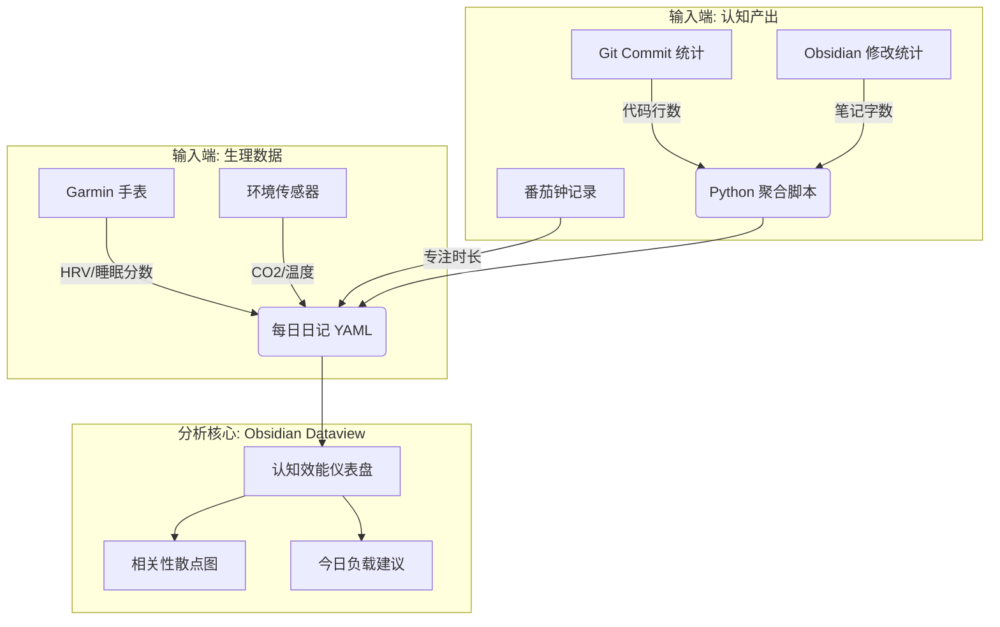

# 🧬 认知效能工程化：实施指南

> **核心目标**：将你的身体状态（HRV、睡眠）与认知产出（代码、写作、教学）建立数学关联，寻找你的 **"生物黄金时刻"**。

---

## 🏗️ 1. 系统架构图

这个系统不需要复杂的云端服务器，完全基于你的 **Obsidian + 本地 Python 脚本** 即可实现。



---

## 🛠️ 2. 数据标准化 (第一步)

为了能分析，必须将目前散落在文本中的数据结构化。建议在你的 **"每日日记"** 模板中强制包含以下 YAML 或 Dataview 字段：

```markdown
---
date: 2026-02-18
tags: #日记
# 生理指标 (Morning Input)
hrv: 42
sleep_score: 85
readiness: 75 # Garmin/Whoop 的准备度

# 认知产出 (Evening Input)
focus_hours: 4.5 # 深度工作时长
code_commits: 12 # 自动填充或手填
output_rating: 8 # 主观满意度 (1-10)
energy_level: 7 # 主观精力值 (1-10)
---
```

### 📏 附录：数据定义与获取指南

#### 1. `focus_hours` (深度专注时长)

- **定义**：完全不受打扰、处于心流状态的高价值工作时长。不包括回消息、开会、碎片化阅读。
- **获取方式**：
  - **番茄钟统计**：如果你用番茄钟，直接统计 `番茄数 * 25分钟 / 60`。
  - **RescueTime/ScreenTime**：查看 IDE (VS Code, Cursor) + Obsidian 的活跃时长。
  - **估算**：早/中/晚各有几个“一小时整块时间”？

#### 2. `code_commits` (代码提交/产出量)

- **定义**：量化你的“硬产出”。不一定是 Commit 数量，也可以是“完成的文档数”或“解决的 Ticket 数”。只统计“实质性产出”。
- **获取方式**：
  - **GitHub/Git**：终端运行 `git shortlog -sn --since="midnight" --author="YourName"`。
  - **Obsidian**：今天新建或大幅修改的 `.md` 文件数量。
  - **替代指标**：如果没有写代码，可以填“写作字数 / 1000”。例如写了3000字，填 3。

#### 3. `output_rating` (主观产出评分)

- **定义**：你对自己今天工作成果的满意度 (1-10)。这是一个主观兜底指标。
- **评分标准**：
  - **10分**：攻克了极难的 Bug / 完成了核心架构设计 / 写出了满意的文章。
  - **8分**：按计划完成了所有任务，节奏很顺。
  - **5分**：做了一天杂事，感觉忙但没产出。
  - **3分**：被各种打断，甚至没开始干正事。
  - **1分**：完全摆烂 / 生病休息。

**💡 建议**：不要依赖手动回忆。写一个简单的 Python 脚本 (`sync_health_data.py`)，每天早上运行一次，自动从 Garmin API 拉取前一晚的数据并填充到新建的日记文件中。

---

## 📊 3. 核心分析模型 (DataviewJS)

一旦有了连续 7 天的数据，就可以用 DataviewJS 渲染出 **"生理-产出关联图"**。

### 视图 A：寻找你的"巅峰阈值"

_这也是你最想知道的：HRV 达到多少时，我写代码最顺？_

```javascript
// Obsidian DataviewJS 伪代码
const pages = dv.pages("#日记").where((p) => p.hrv && p.focus_hours);

// 绘制散点图 (需安装 Obsidian Charts 插件)
const chartData = {
  type: "scatter",
  data: {
    datasets: [
      {
        label: "HRV vs 深度工作时长",
        data: pages.map((p) => ({ x: p.hrv, y: p.focus_hours })),
        backgroundColor: "rgba(75, 192, 192, 0.6)",
      },
    ],
  },
  options: {
    scales: {
      x: { title: { display: true, text: "HRV (ms)" } },
      y: { title: { display: true, text: "深度工作 (小时)" } },
    },
  },
};
window.renderChart(chartData, this.container);
```

### 视图 B：倒 "U" 型曲线验证

_验证耶克斯-多德森定律（Yerkes-Dodson law）：压力（HRV低）太大家不行，但这没压力（HRV过高）是否效率也不高？_

---

## 🤖 4. 自动化闭环 (进阶)

当你积累了 30 天数据后，可以训练一个极简的 **"准备度回归模型"** (Linear Regression)。

**脚本逻辑**：

1.  每天早上 08:00，脚本读取 Garmin 数据 (HRV=35, Sleep=70)。
2.  加载你的历史模型。
3.  **预测**：基于历史数据，当你 HRV=35 时，平均代码产出仅为 2 小时。
4.  **建议**：脚本自动在 Obsidian 日记开头写入：
    > ⚠️ **今日警告**：生理状态低迷（HRV 35）。建议只处理行政杂事或文档阅读，**不要写核心算法**（Bug 率可能增加 40%）。建议下午增加 20 分钟 NSDR。

---

## 🚀 5. 你的 MVP 行动清单

1.  **修改模板**：在日记模板中增加 `hrv`, `sleep_score`, `focus_hours` 三个字段。
2.  **手动记录**：先手动记录 1 周，不要写脚本。体验一下数据的颗粒度。
3.  **可视化**：下周日，用 Dataview 画出第一张散点图。如果看到正相关性，你就会有巨大的动力去自动化它。

这就是 **"认知效能工程化"** —— 不再跟着感觉走，而是像优化服务器性能一样，优化你自己的大脑。
